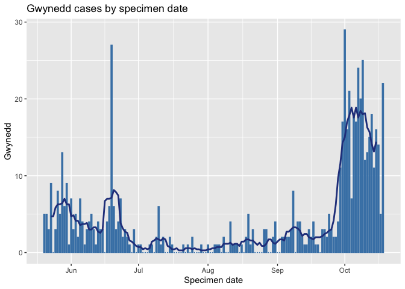
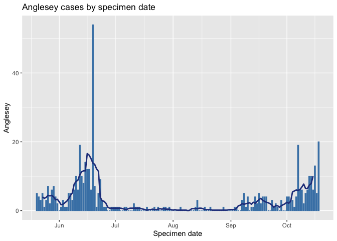
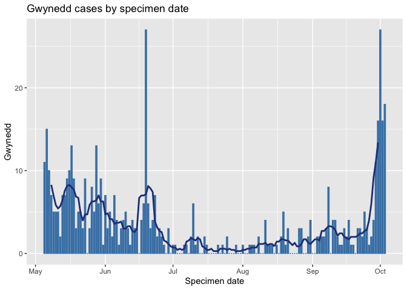
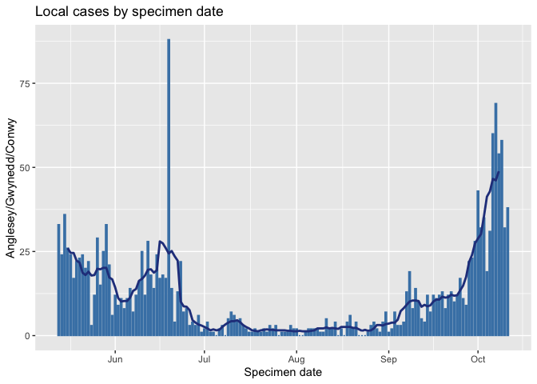
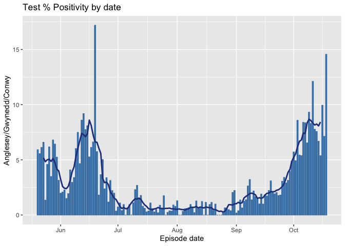
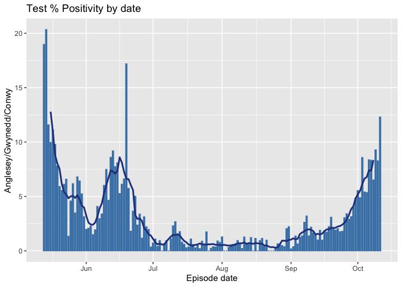

Code
================
Helena
13/10/2020

# Let’s get started

First load the necessary packages (these contain the functions we will
use) and the data. (Don’t laugh at the file path - I forgot R Studio
automatically creates a folder and by the time I remembered I couldn’t
correct it).

``` r
library(dslabs)
library(tidyverse)
library(dplyr)
library(ggplot2)
library(zoo)
library(ggthemes)

cases <- read.csv("~/Desktop/uk_covid19_2/uk_covid19_2/2020-10-10/data_2020-Oct-09.csv")
```

What’s the sum of new cases over the past week and the sum of cases over
the week before?

``` r
sum(cases[(1:7),5])
```

    ## [1] 108535

``` r
sum(cases[(8:14),5])
```

    ## [1] 43912

That’s all I was doing with the uk data, I just use their charts which
is a cop out really.

# More importantly - Wales

I do hope you will be impressed with this section though. First we load
the data from Public Health Wales. Then tell the computer to treat
‘Specimen.date’ as a date.

``` r
w_cases <- read.csv("~/Desktop/uk_covid19_2/uk_covid19_2/2020-10-10/Rapid COVID-19 surveillance data(1).csv", header=TRUE)
w_cases$Specimen.date <- 
  as.Date(w_cases$Specimen.date, format = "%d/%m/%Y")
```

Next pull out the data for Anglesey, Gwynedd and Conwy and put them in
their own tables.

``` r
a_cases <- filter(w_cases, Local.Authority == "Isle of Anglesey")

g_cases <- filter(w_cases, Local.Authority == "Gwynedd")

c_cases <- filter(w_cases, Local.Authority == "Conwy")
```

Next create a new dataframe where Conwy, Anglesey and Gwynedd each have
their own columns, along with the testing episodes for each county.I
just take the data from row 6 onwards, as turnaround times are 1-6 days
(ish), so the data from the top rows is incomplete. Row 157 was the last
row when I started doing it but the table gets longer each week (not
near 65,000 rows yet though\!) so this row number could be updated.

``` r
newdf2 <- data.frame("Specimen date" = c_cases$Specimen.date[6:157],
                    "Conwy" = c_cases$Cases..new.[6:157],
                    "Anglesey" = a_cases$Cases..new.[6:157],
                    "Gwynedd" = g_cases$Cases..new.[6:157],
                    "Conwy_episodes" = c_cases$Testing.episodes..new.[6:157],
                    "Anglesey_episodes" = a_cases$Testing.episodes..new.[6:157],
                    "Gwynedd_episodes" = g_cases$Testing.episodes..new.[6:157])
```

Add columns to the new dataframe for the AGC total and the rolling
averages

``` r
newdf2 <- newdf2 %>% 
  mutate("roll_mean_C" = rollmean(Conwy, 7, fill = NA))
newdf2 <- newdf2 %>% 
  mutate("roll_mean_G" = rollmean(Gwynedd, 7, fill = NA))
newdf2 <- newdf2 %>% 
  mutate("roll_mean_A" = rollmean(Anglesey, 7, fill = NA))
newdf2 <- newdf2 %>% 
  mutate("AGC" = (Conwy+Anglesey+Gwynedd))
newdf2 <- newdf2 %>% 
  mutate("roll_mean" = rollmean(AGC, 7, fill = NA))
newdf2 <- newdf2 %>% 
  mutate("AGC_episodes" = (Conwy_episodes +
                             Anglesey_episodes+
                             Gwynedd_episodes))
newdf2 <- newdf2 %>% 
  mutate("roll_mean_episodes" = rollmean(AGC_episodes, 7, fill = NA))
newdf2 <- newdf2 %>% 
  mutate("Per_Positivity" = ((AGC/AGC_episodes)*100))
newdf2 <- newdf2 %>% 
  mutate("roll_mean_positivity" = rollmean(Per_Positivity, 7, fill = NA))
```

Make a lovely plot for Conwy

``` r
c_plot <- ggplot(data = newdf2, aes(x=Specimen.date, y=Conwy))+
  geom_bar(stat="identity", fill="steelblue", color = "steelblue",
           width = 0.6)+
  labs(x = "Specimen date",
       y = "Conwy")+
  geom_line(data = newdf2, aes(x=Specimen.date, y=roll_mean_C), 
            color = "royalblue4",
            size = 1)+
  ggtitle("Conwy cases by specimen date")

c_plot
```

    ## Warning: Removed 6 row(s) containing missing values (geom_path).

<!-- --> Make a lovely
plot for Gwynedd

``` r
g_plot <- ggplot(data = newdf2, aes(x=Specimen.date, y=Gwynedd))+
  geom_bar(stat="identity", fill="steelblue", color = "steelblue",
           width = 0.6)+
  labs(x = "Specimen date",
       y = "Gwynedd")+
  geom_line(data = newdf2, aes(x=Specimen.date, y=roll_mean_G), 
            color = "royalblue4",
            size = 1)+
  ggtitle("Gwynedd cases by specimen date")

g_plot
```

    ## Warning: Removed 6 row(s) containing missing values (geom_path).

<!-- --> Make a lovely
plot for Anglesey

``` r
a_plot <- ggplot(data = newdf2, aes(x=Specimen.date, y=Anglesey))+
  geom_bar(stat="identity", fill="steelblue", color = "steelblue",
           width = 0.6)+
  labs(x = "Specimen date",
       y = "Anglesey")+
  geom_line(data = newdf2, aes(x=Specimen.date, y=roll_mean_A), 
            color = "royalblue4",
            size = 1)+
  ggtitle("Anglesey cases by specimen date")

a_plot
```

    ## Warning: Removed 6 row(s) containing missing values (geom_path).

<!-- --> Make a lovely
plot for these 3 regions combined

``` r
agc_plot <- ggplot(data = newdf2, aes(x=Specimen.date, y=AGC))+
  geom_bar(stat="identity", fill="steelblue", color = "steelblue",
           width = 0.6)+
  labs(x = "Specimen date",
       y = "Anglesey/Gwynedd/Conwy")+
  geom_line(data = newdf2, aes(x=Specimen.date, y=roll_mean), 
            color = "royalblue4",
            size = 1)+
  ggtitle("Local cases by specimen date")

agc_plot
```

    ## Warning: Removed 6 row(s) containing missing values (geom_path).

<!-- --> Make a lovely
plot for AGC testing episodes

``` r
agc_episodes_plot <- ggplot(data = newdf2, aes(x=Specimen.date, y=AGC_episodes))+
  geom_bar(stat="identity", fill="steelblue", color = "steelblue",
           width = 0.6)+
  labs(x = "Episode date",
       y = "Anglesey/Gwynedd/Conwy")+
  geom_line(data = newdf2, aes(x=Specimen.date, y=roll_mean_episodes), 
            color = "royalblue4",
            size = 1)+
  ggtitle("Testing episodes by date")

agc_episodes_plot
```

    ## Warning: Removed 6 row(s) containing missing values (geom_path).

<!-- --> Make a lovely
plot for test positivity. I’m estimating positivity by doing
((AGC/AGC\_episodes)\*100) which isn’t going to be totally right as it
doesn’t account for the same case being tested more than once but it’s
the best I can do.

``` r
agc_positivity <- ggplot(data = newdf2, aes(x=Specimen.date, y= Per_Positivity))+
  geom_bar(stat="identity", fill="steelblue", color = "steelblue",
           width = 0.6)+
  labs(x = "Episode date",
       y = "Anglesey/Gwynedd/Conwy")+
  geom_line(data = newdf2, aes(x=Specimen.date, y=roll_mean_positivity), 
            color = "royalblue4",
            size = 1)+
  ggtitle("Test % Positivity by date")

agc_positivity
```

    ## Warning: Removed 6 row(s) containing missing values (geom_path).

<!-- -->

THE END
